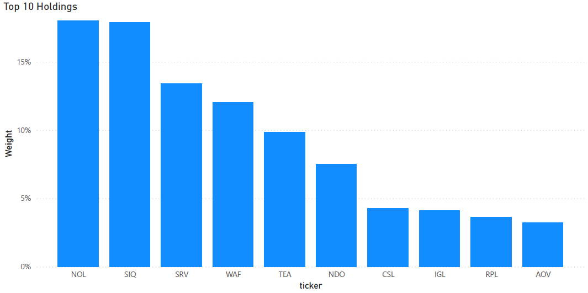
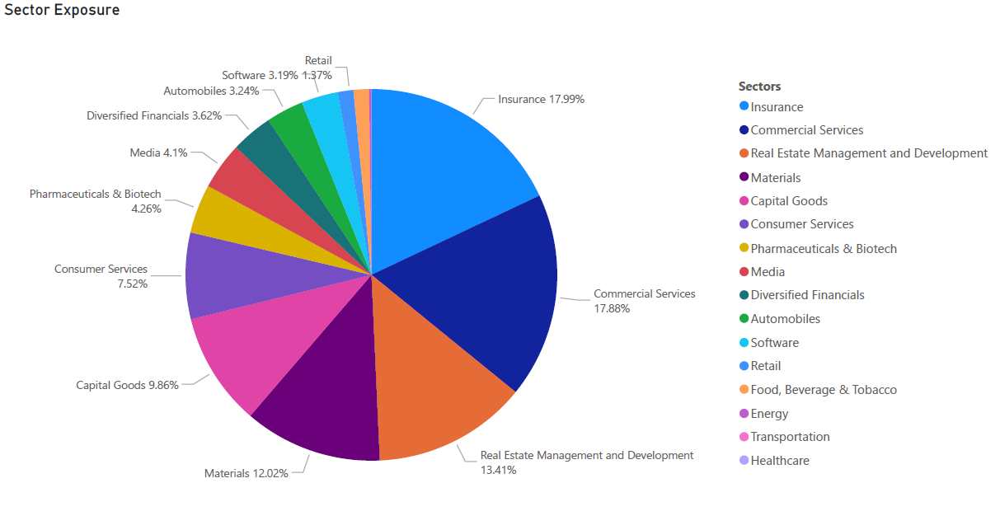
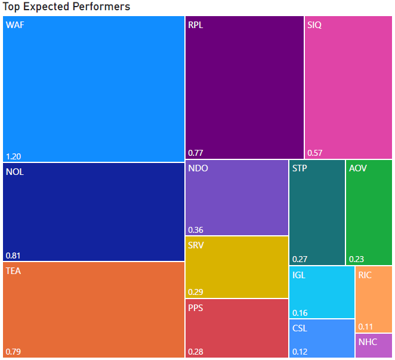

# Financial-Analytics-Pipeline

This repository presents a comprehensive pipeline for processing financial data. The solution integrates data ingestion, transformation, enhancement, portfolio optimization, and dashboard reporting in a modular, scalable manner.

---

## Technology Stack

* **Languages:** Python, SQL
* **Libraries/Tools:** Pandas, NumPy, cvxpy, Regular Expressions, Requests, SQLAlchemy, psycopg2
* **Database:** PostgreSQL
* **API Source:** SWS API
* **Visualization Platform:** Power BI

---

## Phase 1: Data Collection and ETL

This phase focuses on extracting data from APIs, transforming it into structured formats, and loading it into a PostgreSQL database.

| Step | Script                               | Purpose                                                              |
| ---- | ------------------------------------ | -------------------------------------------------------------------- |
| 1    | `1.Get_Exchanges.py`                 | Retrieves a list of exchanges and the number of companies in each.   |
| 2    | `2.Get_Companies.py`                 | Fetches ticker symbols and basic company data per exchange.          |
| 3    | `3.Get_All_Data.py`                  | Collects comprehensive datasets including listings, statements, etc. |
| 4    | `4.1Get_All_Data_Failures.py`        | Retries any failed data retrieval attempts for tickers.              |
| 5    | `5.Transpose_Statements.py`          | Transforms raw data to match the target database schema.             |
| 6    | `6.Load_temp_DB.py`                  | Loads the transformed data into a staging database.                  |
| 7    | `7.Insider_transactions_identify.py` | Detects and removes duplicate insider transaction records.           |
| 8    | `8.Move_To_Prod.py`                  | Transfers validated data into the production environment.            |

---

## Phase 2: Data Enhancement

The enhancement layer adds analytical value to the raw data, including text parsing and the creation of ranking metrics.

| Step | Script                  | Purpose                                                                  |
| ---- | ----------------------- | ------------------------------------------------------------------------ |
| 1    | `1.Snowflake.py`        | Constructs an attribution and ranking table across key dimensions.       |
| 2    | `2.NLP_Extract_Data.py` | Extracts additional data from textual sources using regular expressions. |
| 3    | `3.Final_Reformat.py`   | Cleans and prepares the enhanced data for final storage.                 |
| 4    | `4.Load_DB.py`          | Loads the enhanced data into the database.                               |

---

## Phase 3: Analytics and Portfolio Optimization

This stage involves selecting top-performing stocks based on fundamental attributes and generating an optimized portfolio.

| Step | Script                            | Purpose                                                        |
| ---- | --------------------------------- | -------------------------------------------------------------- |
| 1    | `1.1.Extract_Top_50_Snowflake.py` | Selects the top 50 companies using a composite scoring system. |
| 2    | `2.Get_Expected_Returns.py`       | Calculates returns, volatility, and Sharpe ratios.             |
| 3    | `3.Portf_opt.py`                  | Performs portfolio optimization to maximize Sharpe ratio.      |

**Portfolio Constraints:**

* Only long positions allowed
* Must include at least one stock from each primary industry
* No more than 10% allocation to any single stock

---

## Phase 4: Reporting and Dashboards

Final insights and analytics are visualized using Power BI dashboards, highlighting portfolio composition and performance metrics.

* Top Holdings Breakdown
* Sector Allocation Overview
* High-Performing Stocks Based on Forecasted Returns

---

## Workflow Diagram and Dashboard Previews

---

## License

This project is licensed under the MIT License. See the [LICENSE](./LICENSE) file for more details.

